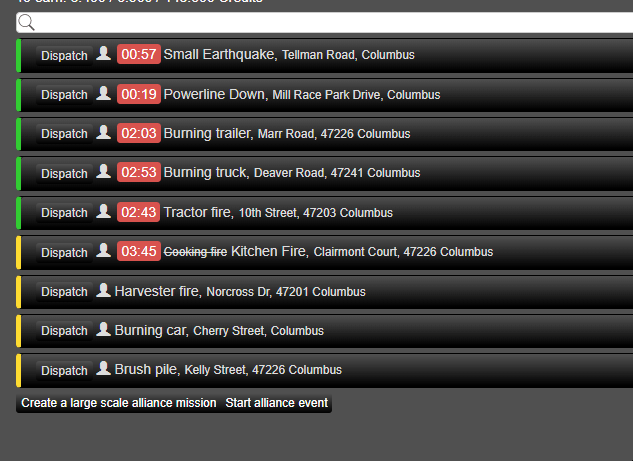

# MM_missionTimer
Original script by KBOE2, modified and republished with permission. This version adds the mission timer to the mission header in the mission list.

Example/Voorbeeld:

[TAMPERMONKEY REQUIRED!](https://www.tampermonkey.net/)

[Click here to install the script](https://github.com/MisteryMan/MM_missionTimer/raw/master/MM_missionTimer.user.js)

# Changelog:

## [1.1.2] June 29, 2020

### [Added]

- Automatically hiding timer element when the timer is no longer needed.

## [1.1.1] June 28, 2020

### [Removed]
- Removed timer from yellow status missions. Evidence showed that timers from yellow status and green status could differ hugely. Therefor the yellow timer generation has been disabled.

## [1.1] June 28, 2020

### [Changed]
- Moved countdown timer location to mission header.

## [1.0.3] KBOE2 Original base version.
